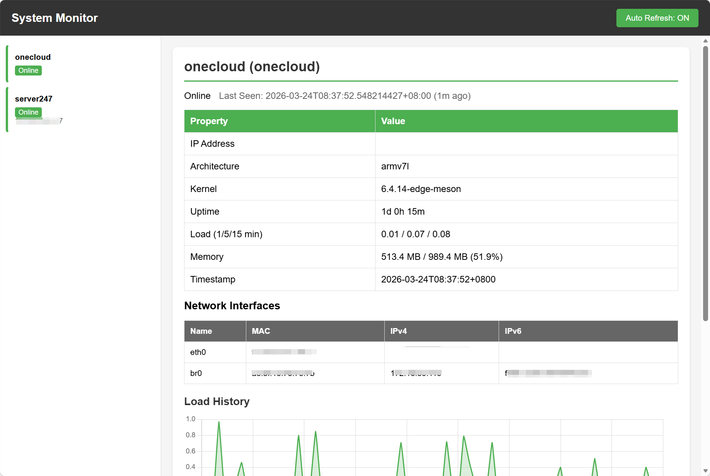
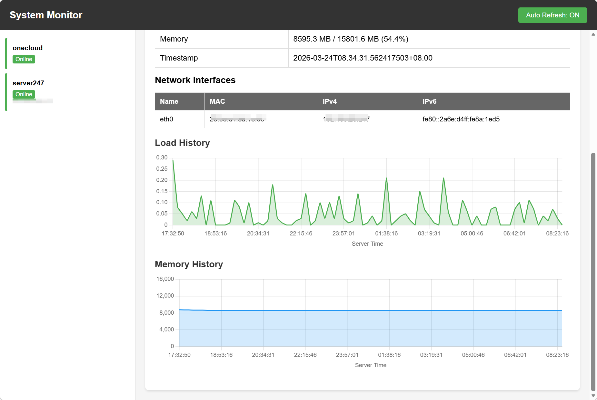

# System Monitor

一个轻量级的跨平台服务器监控系统，支持 Go 和 C 两种实现。

## 特性

- **双语言实现**：Go 版本（跨平台）和 C 版本（仅 Linux）
- **系统信息采集**：hostname, arch, kernel, uptime, load, memory, network (MAC, IPv4, IPv6)
- **Web 界面**：实时展示客户端状态，包含负载和内存历史图表
- **多服务器支持**：客户端可以向多个服务器同时上报数据
- **自动刷新**：Web 页面自动刷新，可随时开关
- **离线检测**：超过 2 小时未收到数据自动标记为离线
- **历史记录**：存储 128 条负载和内存历史数据

## 快速开始

### Go 版本

```bash
# 启动服务器
./server --port 8080 --url systemmonitor/v1

# 启动客户端
./client --id my-server http://localhost:8080/systemmonitor/v1/put
```

### C 版本 (Linux)

```bash
# 编译
cd C
make

# 启动服务器
./server --port 8080 --url systemmonitor/v1

# 启动客户端
./client --id my-server http://localhost:8080/systemmonitor/v1/put
```

## 界面预览

<!-- 图片 1: 客户端列表和详情页面 -->


<!-- 图片 2: 图表展示 -->


## 使用说明

### 命令行参数

**服务器端：**

| 参数 | 必填 | 说明 |
|-----|------|-----|
| `--port, -p` | 是 | 监听端口 |
| `--url, -u` | 是 | URL 前缀路径 |
| `--quiet` | 否 | 静默模式 |

**客户端：**

| 参数 | 必填 | 说明 |
|-----|------|-----|
| `--id` | 否 | 客户端识别码（默认随机） |
| `--interval, -i` | 否 | 发送间隔（秒），默认 60 |
| URL | 是 | 服务器地址（支持多个） |

### 使用示例

```bash
# 服务器
./server --port 8080 --url systemmonitor/v1

# 客户端（单个服务器）
./client --id server01 --interval 30 http://192.168.1.100:8080/systemmonitor/v1/put

# 客户端（多个服务器）
./client --id server01 --interval 30 http://192.168.1.100:8080/systemmonitor/v1/put http://192.168.1.101:8080/systemmonitor/v1/put
```

访问 `http://localhost:8080/` 查看 Web 界面。

## 工作原理

### 系统架构

```
┌─────────────┐      JSON POST       ┌─────────────┐
│   Client   │ ──────────────────▶  │   Server    │
│  (采集端)  │    每隔N秒发送一次    │  (展示端)   │
└─────────────┘                      └─────────────┘
       │                                   │
       │                                   ▼
       │                          ┌─────────────┐
       │                          │  Web UI     │
       │                          │  (展示页面) │
       │                          └─────────────┘
       │
       ▼
┌─────────────────────────────────────────────────┐
│  采集内容: hostname, arch, kernel, uptime,      │
│  load, memory, network (name, mac, ipv4, ipv6) │
└─────────────────────────────────────────────────┘
```

### 工作流程

1. **客户端**：定期采集本地系统信息（hostname, load, memory, network 等），封装为 JSON 并 POST 到服务器
2. **服务器**：接收客户端数据，存储到内存中的 map，按 client_id 区分不同客户端
3. **Web 界面**：
   - 左侧显示所有在线客户端列表
   - 右侧显示选中客户端的详细信息
   - 使用 Chart.js 绘制负载和内存历史图表
   - 自动刷新页面数据

### 技术实现

- **Go 版本**：使用 `net/http` 构建 HTTP 服务器，`json.Unmarshal` 解析 JSON，内存 map 存储数据
- **C 版本**：使用 socket 原始 API 收发 HTTP 请求，parson 库解析 JSON，pthread 多线程处理并发
- **数据存储**：所有数据存储在内存中，支持 128 条历史记录（负载和内存），FIFO 滚动
- **离线检测**：记录每个客户端最后通信时间，超过 2 小时未收到数据标记为离线

### API 接口

| 端点 | 方法 | 说明 |
|-----|------|-----|
| `/` | GET | 根路径，重定向到 index.html |
| `/{url}/index.html` | GET | Web 页面 |
| `/{url}/data` | GET | JSON 数据 |
| `/{url}/put` | POST | 接收客户端数据 |

## 文档

- [编译指南](doc/编译指南.md)
- [部署指南](doc/部署指南.md)
- [项目概述](doc/项目概述.md)

## 许可证

MIT License